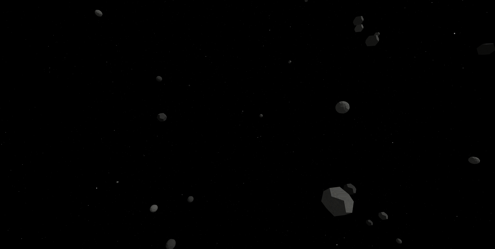

# 🌌 Three.js Starfield & Asteroids

A procedurally generated space scene built with Three.js, featuring 10,000 glowing stars and 100 animated asteroids drifting through deep space.



## ✨ Features

- 10,000 procedurally placed stars with soft glow effect
- 100 asteroids with randomized size, shape, speed and direction
- Rock texture support for realistic asteroid surfaces
- Exponential fog for natural depth falloff
- Directional lighting for 3D shading and shadow
- Asteroids respawn with new random properties when drifting out of range
- Fully responsive — adapts to any screen size

## 🚀 Getting Started

No build tools required. Just open `index.html` with a local server.

**Option 1 – VS Code Live Server**
Install the [Live Server extension](https://marketplace.visualstudio.com/items?itemName=ritwickdey.LiveServer), right-click `index.html` and select *Open with Live Server*.

**Option 2 – Node.js**
```bash
npx serve .
```

## 📁 Project Structure

```
threejs-starfield/
├── index.html
├── main.js
├── asteroid-texture.jpg   # add your own rock texture here
└── README.md
```

## 🪨 Texture

Place a rock/stone texture named `asteroid-texture.jpg` in the root folder.
Free textures available at [ambientcg.com](https://ambientcg.com) — search for "Rock".

## 🛠️ Built With

- [Three.js](https://threejs.org/) r160

## 📄 License

MIT
